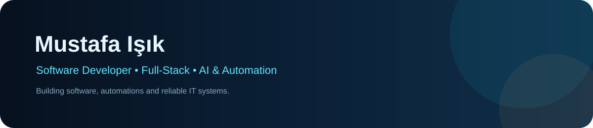
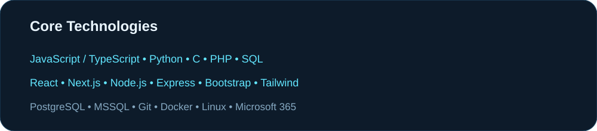
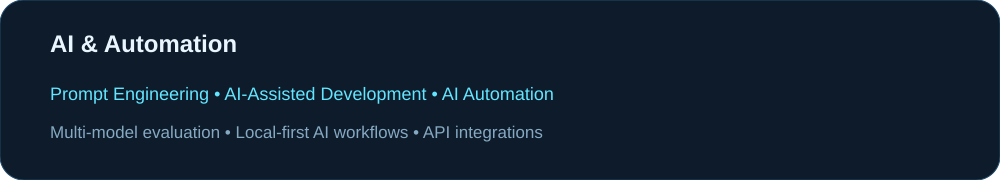
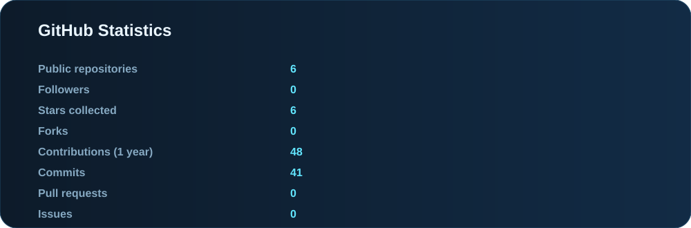
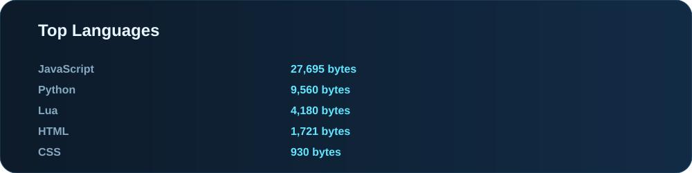
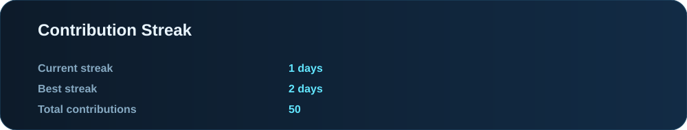
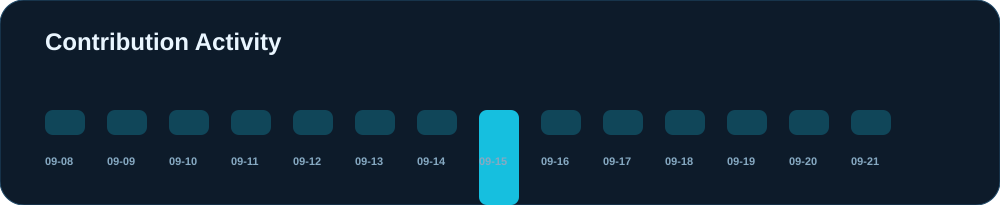
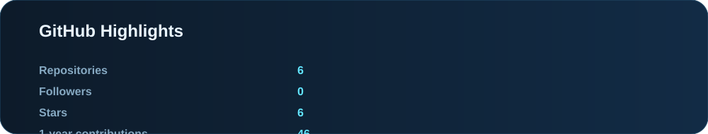

  

 

  
  
  

  

## 👋 About Me

I'm **Mustafa Işık**, a Software Developer and IT Specialist focused on building practical software, automating workflows, and keeping real-world IT environments running reliably.

- 💻 Full-stack web development, APIs, databases and backend systems
- 🤖 AI-assisted development, prompt engineering and automation
- 🖥️ IT infrastructure, Microsoft 365, servers, networks and endpoint support
- 🔐 CCTV, access control, PDKS and hardware deployments
- 🧩 Troubleshooting, system administration and end-user support
- 🚀 Building products that combine software, automation and useful UX

## 🧰 Tech Stack

  

## 🤖 AI & Automation

  

## 🚀 Featured Projects

| Project | Focus |
|---|---|
| **Z3Motion** | Camera + voice gesture-control desktop application with AI-assisted interaction |
| **AniVerse** | Anime streaming/social platform concept with profiles, watch-together, community and automation features |
| **WatchHeaven TV** | Streaming-oriented web project and media experience |
| **Kartal Halı Yıkama** | Business website and digital presence project |

## 💼 Professional Experience

### PKF Teknoloji
**Software Development & IT**

Working across software development and IT operations: web applications, backend systems, databases, internal tooling, Microsoft 365, infrastructure, network/device support, hardware deployments, CCTV/access control and PDKS-related systems.

## 📊 GitHub Dashboard

  
    
  
    
  
    
  
    
  

## 🔭 What I'm Building

- **Z3Motion** — local-first camera + voice gesture control
- **AniVerse** — streaming, social and community features
- **AI automation workflows** — practical multi-model and AI-assisted tooling
- **Full-stack products** — clean interfaces backed by real APIs and databases

## 📫 Let's Connect

  <a href="https://github.com/mustafa-z3hir">GitHub</a> •
  <a href="https://www.linkedin.com/in/mustafa-işik-643376408/">LinkedIn</a> •
  <a href="https://dev.to/mustafaisik">Dev.to</a>

 

  

